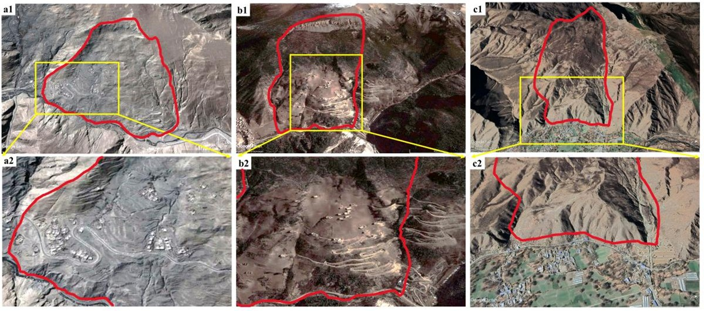
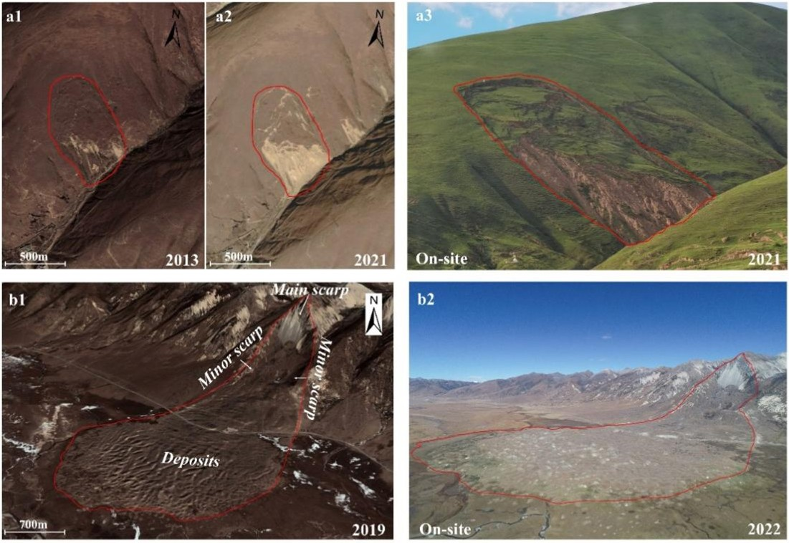
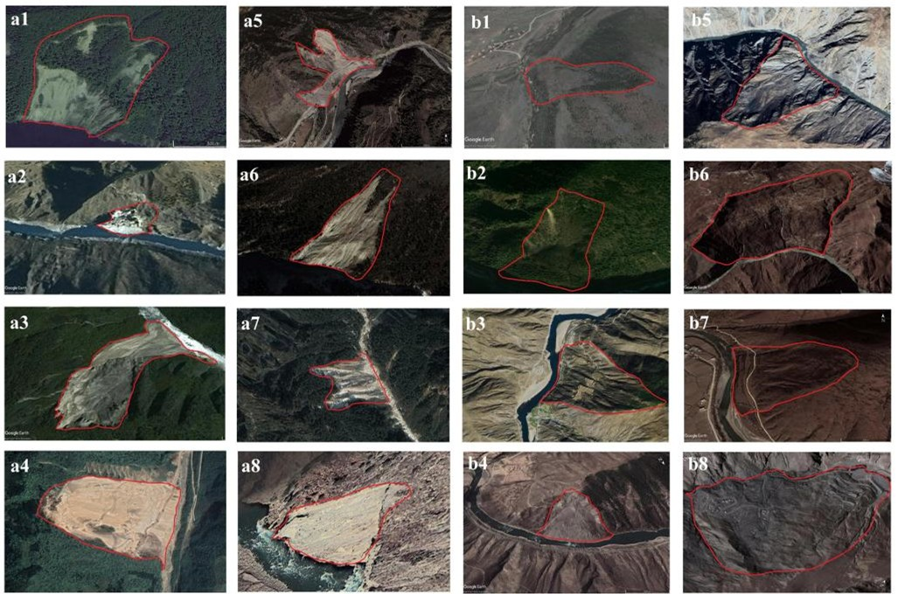
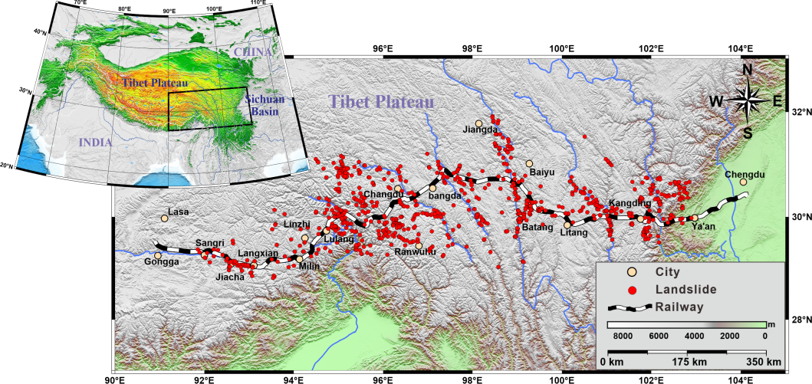

# LRSTTC: Optical Remote Sensing Landslide Dataset along the Sichuan–Tibet Transportation Corridor

## Introduction

Automatic, efficient, and reliable landslide datasets are critically important for landslide recognition, early warning, risk assessment, and post-disaster recovery. To address this strong demand, we constructed an **optical remote sensing landslide dataset along the Sichuan–Tibet Transportation Corridor**, referred to as the **LRSTTC dataset**.

This dataset significantly reduces the time and effort required for sample collection and manual data annotation, thereby facilitating related research in landslide detection and analysis. Considering the limited professional level of the authors, if any errors or issues are found in the dataset, please feel free to contact us for corrections and improvements at:

### Figure 1. Old Landslides and Artificial Buildings

Old landslides with artificial buildings along the Sichuan–Tibet Transportation Corridor.  
(a1–a2) (29°07′28″N, 92°03′37″E),  
(b1–b2) (29°14′26″N, 92°12′40″E), and  
(c1–c2) (29°08′48″N, 92°38′17″E) represent different old landslides.  
Panels a2, b2, and c2 show enlarged areas containing artificial buildings.

📧 **2020126041@chd.edu.cn**

---

## Dataset Construction

The LRSTTC dataset was constructed based on high-resolution optical remote sensing images acquired along the Sichuan–Tibet Transportation Corridor. According to the **time of occurrence** and the **spectral and textural characteristics** of landslides observed in the images, the dataset can be roughly divided into two categories:

- **New Landslides**
- **Old Landslides**

### 1. New Landslides

New landslides are those that occurred recently. Their typical characteristics include:

- Clearly visible **main scarp, landslide body, and toe**
- A distinct sliding surface
- Obvious color differences between the landslide area and surrounding features

These features make new landslides relatively easy to identify in optical remote sensing images.

### 2. Old Landslides

Old landslides occurred earlier and exhibit more complex visual characteristics:

- The color of the landslide body is often similar to surrounding features
- Vegetation may have grown on parts of the landslide
- Despite these changes, the **overall landslide shape**, **back wall**, and **front deposits** can still be observed
- In some cases, **man-made buildings** are located on or above landslide accumulations, posing significant potential hazards

### Figure 2. Satellite Optical Image Interpretation and On-site Survey

Satellite optical image interpretation and on-site survey of landslides along the Sichuan–Tibet Transportation Corridor (STTC).  
(a) (30°58′16″N, 101°09′19″E) represents a **new landslide**, and  
(b) (30°12′09″N, 99°56′10″E) represents an **old landslide**.  
Images a1, a2, and b1 were obtained from **Google Earth**, while a3 and b2 were obtained from **on-site surveys**.

---

## Dataset Applications

The LRSTTC dataset can be used for:

- Landslide detection and segmentation
- Landslide susceptibility and risk assessment
- Early warning systems
- Post-disaster damage assessment
- Training and evaluation of deep learning models for remote sensing applications

---

### Figure 3. Landslide Instances in the LRSTTC Dataset

Representative landslide samples in the LRSTTC dataset.  
(a1–a8) are **new landslides** that occurred recently, while  
(b1–b8) are **old landslides** that occurred over a long period.

---
---

## Download Links

The dataset is publicly available and can be downloaded from the following platforms:

### Google Drive
🔗 https://drive.google.com/drive/folders/1rHdkWwyG6hcthKcHvNF8DNIpDouEeWO4?usp=sharing

### Baidu Cloud
🔗 https://pan.baidu.com/s/1uuWvnS3wErSFTfbcuL-YWQ  
**Extraction Password:** `6xzi`

---

## Citation

If you use this dataset for any academic research, publication, or public presentation, please cite the following paper:

> Jiang W, Xi J, Li Z, et al.  
> **Deep Learning for Landslide Detection and Segmentation in High-Resolution Optical Images along the Sichuan–Tibet Transportation Corridor**.  
> *Remote Sensing*, 2022, 14(21): 5490.  
> https://doi.org/10.3390/rs14215490

---

## Data Region

### Figure 4. Landslide Study Area of the Sichuan–Tibet Transportation Project

Overview of the landslide study area along the Sichuan–Tibet Transportation Project.

---

## License

This dataset is released for **research and academic purposes only**.  
Commercial use is not permitted without explicit permission from the authors.
